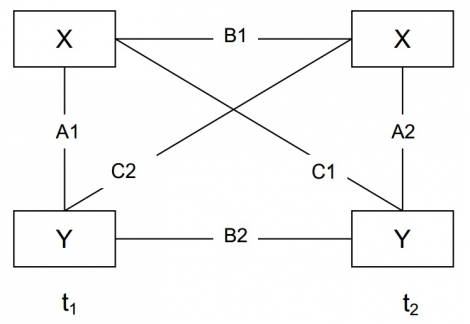
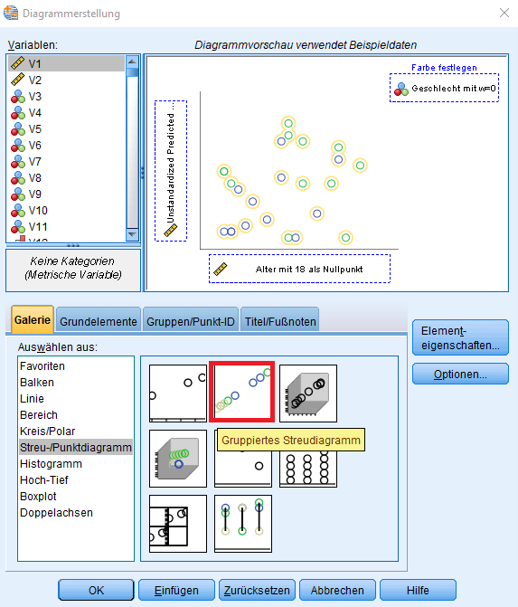
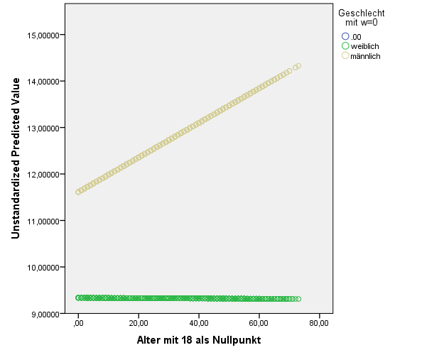

<style>
.onehundredtwenty {
  font-size: 120%;
   }

<style>
.ninety {
  font-size: 90%;
   }

.eightyfive {
  font-size: 85%;
   }
   
.eighty {
  font-size: 80%;
   }
   
.seventyfive {
  font-size: 75%;
   }
   
.seventy {
  font-size: 70%;
   }
</style>


```{r, include = F}
pacman::p_load(tidyverse, knitr, haven, texreg, sjPlot, car, sjmisc, broom, psych, lm.beta, tidytemplate, stargazer, corrplot)

#Default Options - kann bei Gebrauch geändert werden
knitr::opts_chunk$set(warning = F, message = F) # Whether to display errors

soep <- read_spss("../../../data/SOEP_wide_lehrdaten.sav")


allbus <- read_spss("../../../data/allbus2014.sav")
allb_sub <- allbus %>% 
     # select(V84, V86, V81, V420)  %>% 
      rename(alter = V84, 
       bildung = V86, 
       geschl  = V81,  
       einkommen  = V420) %>%
      mutate(alter0 = alter - 18,
       bildung_rec = ifelse(bildung == 6 | bildung == 7, NA, bildung - 1),
       geschl_rec = ifelse(geschl == 2, 0, 1)) %>%
      mutate_all(as.numeric) # alle Werte als numerisch ausgeben

allb_sub <- allb_sub %>%
  rename(prestige_befragter = V112) 
         
mod1 <- lm(prestige_befragter ~ alter0*geschl_rec, data = allb_sub)

```


## Übersicht

1. Übungsaufgabe 5 in SPSS
2. Übungsaufgabe 5 in R


  
<br>
 
  

[Link zum SOEP Datensatz](https://github.com/favstats/Statistische-Modellbildung-II-WS1819/blob/master/data/SOEP_wide_lehrdaten.sav)
  
[Link zum Allbus Datensatz](https://github.com/favstats/Statistische-Modellbildung-II-WS1819/blob/master/data/allbus2014.sav)
  


  

---

##### Aufgabe 1


.eighty[*Benutzen Sie den Datensatz „SOEP_wide_lehrdaten.sav“*]


###### Aufgabe 1a

.eighty[*Berechnen Sie ein Cross-lagged-Design mit zwei Regressionen bzgl. der Variablen Subjektive Gesundheit und Lebenszufriedenheit (Jahre 2003 und 2004)*]

.pull-left[

.seventy[Subjektive Gesundheit
- `gesund_org.2003`
- `gesund_org.2004`
]

]

.pull-right[

.seventy[Lebenszufriedenheit
- `lebensz_org.2003`
- `lebensz_org.2004`
]

]

###### Aufgabe 1b

.eighty[*Welche Aussage lässt sich bzgl. der Stabilität der Variablen Lebenszufriedenheit und Subj. Gesundheit machen?*]

###### Aufgabe 1c

.eighty[*Wie bewerten Sie die kausale Reihenfolge bzgl. der Effekte Subj. Gesundheit <-> Lebenszufriedenheit anhand der „Kreuzkoeffizienten“. Vergleichen Sie hierzu die Kreuzladungen.*]

---

### Cross-Lagged Panel Design

<center>



</center>

Um eine Aussage über die Stabilität tätigen zu können, betrachtet man die Stabilitätskoeffizienten (im
skizzierten Modell die geraden Linien).

T-Test zwischen Koeffizienten (für unabhängige Stichproben):

$$t_{df} = \frac{b_1 - b_2}{\sqrt{(SE_{b_1})^2 + (SE_{b_2})^2}}$$


---

##### Aufgabe 2

.eighty[*Benutzen Sie den Datensatz „allbus2014.sav“*

*Erstellen Sie eine Interaktionsvariable zwischen Geschlecht und Alter und reduzieren Sie vor den folgenden Regressionsanalysen den Datensatz, um die Fälle, bei denen die Geburtenentscheidungen keine besondere Bedeutung mehr für die Gehaltsentwicklung haben sollten (Alter unter 46 Jahren, alter0 < 28). Modell 1 enthält dann Alter und Geschlecht, in Modell 2 kommt die Interaktionsvariable hinzu.*]


###### Aufgabe 2a

.eighty[
_Berechnen	Sie	anhand	von	Modell	1	und	Modell	2	jeweils	das	prognostizierte	Einkommen	eines	Mannes und	einer	Frau	im	Alter	von	jeweils	30 Jahren._
]


###### Aufgabe 2b

.eighty[*Was ist dabei der Interaktionseffekt	und	wie	lässt	er	sich inhaltlich	begründen?*]


---

### Interaktionen berechnen

Formel zur Berechnung eines vorhergesagten Wertes:

$$Intercept + Alter_1 \times x_1 + Geschl \times x_2 + AlterGeschl \times x_3$$
#### Beispiel: 

+ Alter = 20
+ Geschl = 1 ("männlich")

$$Intercept + 20 \times x_1 + 1 \times x_2 + 20 \times 1 \times x_3$$

$x_1$ = b-Koeffizient von Alter

$x_2$ = b-Koeffizient von Geschlecht

$x_3$ = b-Koeffizient von Alter*Geschlecht (Interaktion)


---


### Übungsaufgabe SPSS

.eighty[Erstellen eines temporären Filters:]

```{r, eval=F}
TEMPORARY.
SELECT IF bildung_rec > 3.
```

.eighty[Muss immer vor jedem Befehl ausgeführt werden.]

.eighty[Einen Interaktionsplot in SPSS erstellen]

```{r, eval=F}
REGRESSION
  /DEPENDENT demzufriedenheit
  /METHOD=ENTER alter gender int_alter_gender
  /SAVE PRED.
```

Erstellt eine Variable `PRE_1` welche die unstandardisierten vorhergesagten Werte beinhaltet.

Im Grafikmenu können wir ein Scatterplot erstellen, der die Interaktion visualisiert:

[Nächste Folie]


---


### Übungsaufgabe SPSS

<center>



</center>


---


### Übungsaufgabe SPSS

<center>



</center>


---

### Übungsaufgabe R

```{r}
lebens_mod <- lm(lebensz_org.2002 ~ gesund_org.2001 + lebensz_org.2001, data = soep)
gesund_mod <- lm(gesund_org.2002 ~ gesund_org.2001 + lebensz_org.2001, data = soep)

screenreg(list(lebens_mod, gesund_mod), custom.model.names = c("AV: LZF", "AV: GESUND"))
```


---

### Übungsaufgabe R

T-Test zwischen Koeffizienten:

```{r}

t_test_coefs <- function(mod1, mod2, coef1 = NULL, coef2 = NULL) {
   
   tidy_mod1 <- tidy(mod1) %>% 
      filter(term == coef1)
   
   tidy_mod2 <- tidy(mod2) %>% 
      filter(term == coef2)
   
   b1 <- tidy_mod1$estimate
   b2 <- tidy_mod2$estimate

   se1 <- tidy_mod1$std.error
   se2 <- tidy_mod2$std.error

   oben <- b1 - b2

   unten <- sqrt((se1)^2 + (se2)^2)

   t_value = oben/unten
   
   return(list(t_value = t_value))
}


```

---

### Übungsaufgabe R

T-Test zwischen Koeffizienten:

```{r}
t_test_coefs(lebens_mod, gesund_mod,
             coef1 = "gesund_org.2001",
             coef2 = "lebensz_org.2001")
```

---

### Übungsaufgabe R

Interaktionsplot ausgeben lassen:

```{r, fig.width = 9, fig.height=5.5}
plot_model(mod1, type = "int")
```


