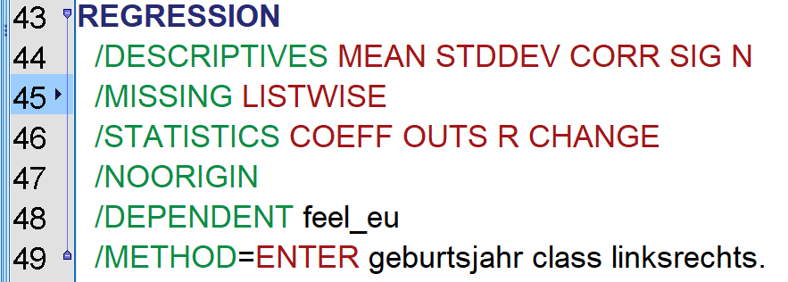
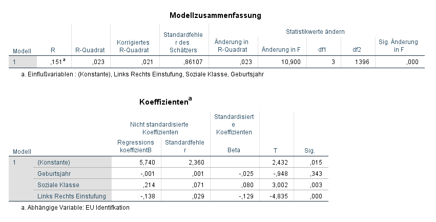
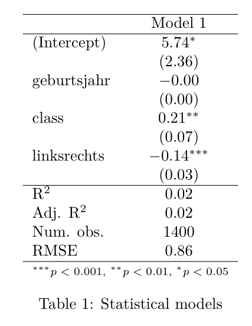

    

```{r xaringan-themer, include = FALSE}
#library(xaringanthemer)
# mono_accent(base_color = "#252525", link_color	= "rgb(198, 219, 239)")
```

<style>
.onehundredtwenty {
  font-size: 120%;
   }

<style>
.ninety {
  font-size: 90%;
   }

.eightyfive {
  font-size: 85%;
   }
   
.eighty {
  font-size: 80%;
   }
   
.seventyfive {
  font-size: 75%;
   }
   
.seventy {
  font-size: 70%;
   }
</style>


```{r setup, echo = F, include=F}
# include=FALSE
options(htmltools.dir.version = FALSE)

pacman::p_load(tidyverse, xaringan)

knitr::opts_chunk$set(echo = F, warning = F, error = F, message = F)

```


# Eckdaten

## Donnerstags, 17:30 – 19:00 

## beginnend ab 18. Oktober 2018... also heute!

## Raum: Breitscheidstraße 2 <br> CIP – Pool 5.005 (5. Stock)

---

# Warum ins Tutorium?

## Gemeinsame Bearbeitung der Aufgaben in SPSS und R

<br>

--

<style type="text/css">
.tg  {border-collapse:collapse;border-spacing:0;border-color:#999;}
.tg td{font-family:Arial, sans-serif;font-size:14px;padding:10px 5px;border-style:solid;border-width:1px;overflow:hidden;word-break:normal;border-color:#999;color:#444;background-color:#F7FDFA;}
.tg th{font-family:Arial, sans-serif;font-size:14px;font-weight:normal;padding:10px 5px;border-style:solid;border-width:1px;overflow:hidden;word-break:normal;border-color:#999;color:#fff;background-color:#26ADE4;}
.tg .tg-uys7{border-color:inherit;text-align:center}
.tg .tg-xldj{border-color:inherit;text-align:left}
</style>
<table class="tg" style="undefined;table-layout: fixed; width: 678px">
<colgroup>
<col style="width: 314px">
<col style="width: 364px">
</colgroup>
  <tr>
    <th class="tg-uys7">SPSS</th>
    <th class="tg-uys7">R</th>
  </tr>
  <tr>
    <td class="tg-xldj">+ Point &amp; Click<br>+ Drag &amp; Drop<br>+ Einfache Bedienung<br>+ Bisherige Standardsoftware<br></td>
    <td class="tg-xldj">+ Statistische Programmiersprache<br>+ Community Support<br>+ Tausende Packages (Add-Ons)<br>+ Open Source und kostenlos<br></td>
  </tr>
  <tr>
    <td class="tg-xldj">- Limitierte Möglichkeiten<br>- Lizenz sehr teuer<br></td>
    <td class="tg-xldj">- „Blender-Lernkurve“: Anfangs fällt das Lernen schwer, doch später fällt es leichter.</td>
  </tr>
</table>

---

class: center

**SPSS Code**



--

**SPSS Output**



---

```{r}
euro <- tidytemplate::load_it("data/euro.Rdata")

mod1 <- lm(feel_eu ~ geburtsjahr + class + linksrechts, data = euro)
```

**R Code**

```{r, eval = F, echo = T}
mod1 <- lm(feel_eu ~ geburtsjahr + class + linksrechts, data = euro)

texreg::texreg(model1)
```

--

**R Output**



---

## Visualisierung

```{r, fig.width=10, fig.height=6, fig.align='center', echo = T}
sjPlot::plot_model(mod1, show.p = T, show.values = T)
```

---


background-image: url("images/map_example.png")
background-position: 50% 50%
background-size: 100%
class: center, top

## Visualisierung

---

## Fragen

+ Wie viele haben schon Erfahrung mit SPSS?
+ Wie viele haben schon Erfahrung mit R?
+ Habt ihr schon eine Idee was ihr machen wollt?

--

## Idee für die erste Sitzung am 18.10.:

**Da keine Übungsaufgabe in erster Woche:**

+ SPSS Basics Einführung/Refresher
+ Kleiner Einführungsworkshop für R
+ Datenmanipulation und –aufbereitung

---

## Bitte folgendes vorbereiten bis zu dem Tutorium:

Mitnahme des eigenen Laptops ist empfohlen 

<br>

**Installation von SPSS 25 auf dem Laptop:**

http://www.stud.uni-stuttgart.de/dienste/software/spss.html

*(VPN wird dafür benötigt: http://www.tik.uni-stuttgart.de/beratung/hilfe/vpn)*

**Installation von R und Rstudio auf dem Laptop:**

+ R Version: 3.5.1: https://cran.r-project.org/bin/windows/base/
+ Rstudio: https://www.rstudio.com/products/rstudio/download/

---

class: center, middle

# Übungsaufgaben bitte an:


##<a href="mailto:fabio-antonello.votta@sowi.uni-stuttgart.de">fabio-antonello.votta@sowi.uni-stuttgart.de</a>

Mit Betreff: SMII Tutorium - Aufgabe X - [DEIN NAME]

#bis jeweils Montag um 12 Uhr senden!

---

class: center, middle

# Alles klar?

--

## Dann bis Bald! :)
